Mitigating Discrimination in Insurance with Wasserstein Barycenters
================

This repository contains the code for our Article _Mitigating Discrimination in Insurance with Wasserstein Barycenters_.  You can find the code arranged as follows. 

```
FairInsurance
│   README.md
│   requirements.txt
│
└───graphs
│   │
│   └───figure-markdown_strict
│   |   │   figs
```

All data is open source the graphs can be replicated with the code below. 


# Data Overview

Graphical parameter

``` r
library(wesanderson)
colr = wes_palette("Darjeeling1")
vectcolor = 
vectcolor = c(colr[c(5,1,2,3)],wes_palette("Darjeeling2")[2],wes_palette("Royal1")[2],wes_palette("Rushmore1")[3])
names(vectcolor)=c("0","1","A","B","with","without","2")
```

From <http://cas.uqam.ca/> (CASdatasets) R package

``` r
library(CASdatasets)
data(freMPL1)
data(freMPL2)
data(freMPL3)
data(freMPL4)

freMPL = rbind(freMPL1[,-22],freMPL2[,-22],
               freMPL3[,-c(12,23)],freMPL4[,-c(12,23)])

idx = which(freMPL$Exposure>.9)
df = freMPL[idx,]
df$ClaimAmount = (df$ClaimAmount>0)*1
nom_y = "ClaimAmount"
nom_s = "Gender"
names(df)[which(names(df)==nom_y)]="y"
names(df)[which(names(df)==nom_s)]="sensitive"
df$y = as.factor(df$y)
levels(df$y) = c("GOOD","BAD")
df$y = relevel(df$y,  "GOOD")
df = df[,-which(names(df) %in% c("RecordBeg","RecordEnd",
                                  "Exposure"))]
df$LicAge = as.numeric(df$LicAge)
df$DrivAge = as.numeric(df$DrivAge)
df$HasKmLimit = as.numeric(df$HasKmLimit)
df$BonusMalus = as.numeric(df$BonusMalus)
df$RiskVar = as.numeric(df$RiskVar)
levels(df$sensitive) = c("B","A")
```

The entire dataset is

``` r
str(df)
```

    'data.frame':   12437 obs. of  18 variables:
     $ LicAge     : num  454 163 332 447 408 222 316 284 459 244 ...
     $ VehAge     : Factor w/ 9 levels "0","1","10+",..: 1 4 2 1 9 8 1 7 8 5 ...
     $ sensitive  : Factor w/ 2 levels "B","A": 2 1 2 2 1 1 1 1 2 1 ...
     $ MariStat   : Factor w/ 2 levels "Alone","Other": 2 2 2 1 2 2 2 2 2 2 ...
     $ SocioCateg : Factor w/ 52 levels "CSP1","CSP16",..: 21 27 23 18 21 21 21 21 21 23 ...
     $ VehUsage   : Factor w/ 4 levels "Private","Private+trip to office",..: 3 1 3 3 2 2 1 2 1 2 ...
     $ DrivAge    : num  56 63 46 58 54 56 45 43 56 38 ...
     $ HasKmLimit : num  0 0 0 0 0 0 0 0 1 0 ...
     $ BonusMalus : num  50 85 50 50 54 50 60 50 50 50 ...
     $ VehBody    : Factor w/ 9 levels "bus","cabriolet",..: 7 6 6 6 5 6 6 6 6 6 ...
     $ VehPrice   : Factor w/ 26 levels "A","B","C","D",..: 16 7 8 11 10 8 8 5 6 8 ...
     $ VehEngine  : Factor w/ 6 levels "carburation",..: 2 5 2 2 5 5 5 5 5 5 ...
     $ VehEnergy  : Factor w/ 4 levels "diesel","eletric",..: 1 4 1 1 4 4 4 4 4 4 ...
     $ VehMaxSpeed: Factor w/ 10 levels "1-130 km/h","130-140 km/h",..: 9 4 5 7 7 6 7 4 4 6 ...
     $ VehClass   : Factor w/ 6 levels "0","A","B","H",..: 6 3 3 5 5 5 3 3 3 5 ...
     $ y          : Factor w/ 2 levels "GOOD","BAD": 2 1 1 1 1 1 1 1 1 1 ...
     $ RiskVar    : num  17 16 18 18 17 9 16 20 18 5 ...
     $ Garage     : Factor w/ 3 levels "Collective garage",..: 3 2 3 2 2 2 2 2 2 2 ...

Counts for the outcome *y* (occurence of a claim) are

``` r
table(df$y)
```


     GOOD   BAD 
    11358  1079 

and counts for the sensitive attribute *s* (here the gender) are

``` r
table(df$sensitive)
```


       B    A 
    4464 7973 

For other applications, use for old drivers

``` r
# df$OldDriver = as.factor(df$DrivAge<65)
# nom_s = "OldDriver"
# names(df)[which(names(df)==nom_s)]="sensitive"
# levels(df$sensitive) = c("B","A")
```

and use for young drivers

``` r
# df$YoungDriver = as.factor(df$DrivAge>30)
# nom_s = "YoungDriver"
# names(df)[which(names(df)==nom_s)]="sensitive"
# levels(df$sensitive) = c("B","A")
```

70% observations are use in the *training dataset*, 30% the *validation
dataset*,

``` r
set.seed(123)
val_percent = 0.3
val_idx = sample(1:nrow(df))[1:round(nrow(df) * val_percent)]
  df_train = df[-val_idx, ]
  df_valid = df[ val_idx, ]
  
  glm_with = glm(y ~ ., data   = df_train, 
                family = binomial(link = 'logit'))
  glm_without = glm(y ~ . -sensitive, data   = df_train, 
                family = binomial(link = 'logit'))
  
  rf_with = randomForest(y ~ .,            
                     data   = df_train)      
  rf_without = randomForest(y ~ .-sensitive,            
                     data   = df_train) 
  
dfg = df_train
dfg$y = as.numeric(dfg$y)-1
gbm_with = gbm(y~., data = dfg) 
```

    Distribution not specified, assuming bernoulli ...

``` r
gbm_without = gbm(y~.-sensitive, data = dfg) 
```

    Distribution not specified, assuming bernoulli ...

``` r
df_valid$prob_glm_with = predict(glm_with, df_valid, type = 'response')
df_valid$prob_glm_without = predict(glm_without, df_valid, type = 'response')
df_valid$prob_rf_with = predict(rf_with, newdata= df_valid,type="prob")[,"BAD"]
df_valid$prob_rf_without = predict(rf_without, newdata= df_valid,type="prob")[,"BAD"]
df_valid$prob_gbm_with = predict(gbm_with, df_valid, type = 'response')
```

    Using 100 trees...

``` r
df_valid$prob_gbm_without = predict(gbm_without, df_valid, type = 'response')
```

    Using 100 trees...

# Distribution of scores

``` r
library(kdensity)
xA_glm = df_valid$prob_glm_with[df_valid$sensitive == "A"]
xB_glm = df_valid$prob_glm_with[df_valid$sensitive == "B"]
dk_A_s_glm = kdensity(xA_glm ,kernel="beta")
dk_B_s_glm = kdensity(xB_glm ,kernel="beta")
vx = seq(0,1,length=501)
d_A_s_glm = data.frame(x= vx,
                   y= dk_A_s_glm(vx))
d_B_s_glm = data.frame(x= vx,
                   y= dk_B_s_glm(vx))

xA_gbm = df_valid$prob_gbm_with[df_valid$sensitive == "A"]
xB_gbm = df_valid$prob_gbm_with[df_valid$sensitive == "B"]
dk_A_s_gbm = kdensity(xA_gbm ,kernel="beta")
dk_B_s_gbm = kdensity(xB_gbm ,kernel="beta")
d_A_s_gbm = data.frame(x= vx,
                   y= dk_A_s_gbm(vx))
d_B_s_gbm = data.frame(x= vx,
                   y= dk_B_s_gbm(vx))

xA_rf = df_valid$prob_rf_with[df_valid$sensitive == "A"]
xB_rf = df_valid$prob_rf_with[df_valid$sensitive == "B"]
dk_A_s_rf = kdensity(xA_rf ,kernel="beta")
dk_B_s_rf = kdensity(xB_rf ,kernel="beta")
```

    Warning in stats::optimize(obj_func, lower = lower, upper = upper, tol =
    1e-04): NA/Inf replaced by maximum positive value

    Warning in stats::optimize(obj_func, lower = lower, upper = upper, tol =
    1e-04): NA/Inf replaced by maximum positive value

    Warning in stats::optimize(obj_func, lower = lower, upper = upper, tol =
    1e-04): NA/Inf replaced by maximum positive value

    Warning in stats::optimize(obj_func, lower = lower, upper = upper, tol =
    1e-04): NA/Inf replaced by maximum positive value

``` r
d_A_s_rf = data.frame(x= vx,
                   y= dk_A_s_rf(vx))
d_B_s_rf = data.frame(x= vx,
                   y= dk_B_s_rf(vx))

hist_glm_with = hist(df_valid$prob_glm_with,breaks = seq(0,1,by=.05),plot=FALSE)
hist_glm_without = hist(df_valid$prob_glm_without,breaks = seq(0,1,by=.05),plot=FALSE)
hist_rf_with = hist(df_valid$prob_rf_with,breaks = seq(-.05,1,by=.05),plot=FALSE)
hist_rf_without = hist(df_valid$prob_rf_without,breaks = seq(-.05,1,by=.05),plot=FALSE)
hist_gbm_with = hist(df_valid$prob_gbm_with,breaks = seq(0,1,by=.05),plot=FALSE)
hist_gbm_without = hist(df_valid$prob_gbm_without,breaks = seq(0,1,by=.05),plot=FALSE)
```

# Simple comparisons

``` r
mean(df_train$y=="BAD")
```

    [1] 0.08729612

``` r
mean(df_train$y[df_train$sensitive=="A"]=="BAD")
```

    [1] 0.08900804

``` r
mean(df_train$y[df_train$sensitive=="B"]=="BAD")
```

    [1] 0.08421729

``` r
rA = mean(df_train$y=="BAD")/mean(df_train$y[df_train$sensitive=="A"]=="BAD")
rB = mean(df_train$y=="BAD")/mean(df_train$y[df_train$sensitive=="B"]=="BAD")
```

# Transport from A to B

## Plain logistic (GLM)

``` r
par(mfrow=c(1,3))
plot(d_A_s_glm$x,d_A_s_glm$y,type="l",col=vectcolor["A"],lwd=2,axes=FALSE,xlab="Plain logistic (GLM)",ylab="",ylim=c(0,12),xlim=c(0,.4))
lines(d_B_s_glm$x,d_B_s_glm$y,type="l",col=vectcolor["B"],lwd=2)
  axis(1)
  axis(2)
plot(d_A_s_gbm$x,d_A_s_gbm$y,type="l",col=vectcolor["A"],lwd=2,axes=FALSE,xlab="Boosting adaboost (GBM)",ylab="",ylim=c(0,12),xlim=c(0,.4))
lines(d_B_s_gbm$x,d_B_s_gbm$y,type="l",col=vectcolor["B"],lwd=2)
  axis(1)
  axis(2)  
plot(d_A_s_rf$x,d_A_s_rf$y,type="l",col=vectcolor["A"],lwd=2,axes=FALSE,xlab="Random Forrest (RF)",ylab="",ylim=c(0,12),xlim=c(0,.4))
lines(d_B_s_rf$x,d_B_s_rf$y,type="l",col=vectcolor["B"],lwd=2)
  axis(1)
  axis(2)  
```

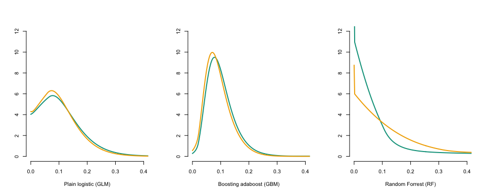

``` r
set.seed(1234)
xA=xA_glm
xB=xB_glm
d_A_s = d_A_s_glm
d_B_s = d_B_s_glm
 if(length(xB)<length(xA)) xA = xA[sample(1:length(xA),size = length(xB))]
 if(length(xB)>length(xA)) xB = xB[sample(1:length(xB),size = length(xA))]

 {
    mat = matrix(c(1,2,0,3), 2)
    par(mfrow = c(2,2))
    layout(mat, c(3.5,1), c(1,3))
    par(mar = c(0.5, 4.5, 0.5, 0.5))
  }

    # Histogram of the mediator variable on the subset of non treated (green)
   
plot(d_A_s$x,d_A_s$y,type="l",col=vectcolor["A"],lwd=2,axes=FALSE,xlab="",ylab="",
xlim=c(0,.4),ylim=c(0,12))
polygon(c(0,d_A_s$x,1),c(0,d_A_s$y,0),col=scales::alpha(vectcolor["A"],.1),border=NA)
axis(1,at=(0:4)/10,label=c(NA,.1,.2,.3,.4))
  par(mar=c(4.5, 4.5, 0.5, 0.5))
  plot(sort(xA), sort(xB),
       col = vectcolor[1], lwd = 2,
       type = "l",
       xlab = "",
       ylab = "",
       xlim=c(0,.4),
       ylim=c(0,.4),
       axes=FALSE)
  abline(a = 0, b = 1, col = vectcolor[4], lty = 2)
  axis(1)
  axis(2)
  mtext("score distribution, S=A", side=1,line=3, col = "black")
  mtext("score distribution, S=B", side=2,line=3, col = "black")

    # Histogram of the mediator variable the subset of treated (orange)
    par(mar = c(4.5, 0.5, 0.5, 0.5))
    plot(d_B_s$y,d_B_s$x,type="l",col=vectcolor["B"],lwd=2,ylim=c(0,.4),xlim=c(0,12),xlab="",ylab="",axes=FALSE)
    polygon(c(0,d_B_s$y,0),c(0,d_B_s$x,1),col=scales::alpha(vectcolor["B"],.1),border=NA)
    axis(2,at=(0:4)/10,label=c(NA,.1,.2,.3,NA))
```

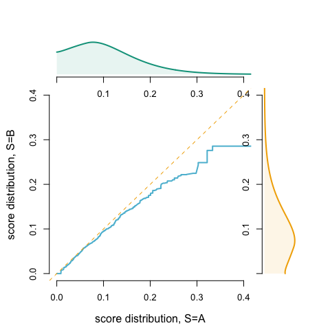

## Gradient boosting (GBM)

``` r
set.seed(1234)
xA=xA_gbm
xB=xB_gbm
d_A_s = d_A_s_gbm
d_B_s = d_B_s_gbm
 if(length(xB)<length(xA)) xA = xA[sample(1:length(xA),size = length(xB))]
 if(length(xB)>length(xA)) xB = xB[sample(1:length(xB),size = length(xA))]

 {
    mat = matrix(c(1,2,0,3), 2)
    par(mfrow = c(2,2))
    layout(mat, c(3.5,1), c(1,3))
    par(mar = c(0.5, 4.5, 0.5, 0.5))
  }

plot(d_A_s$x,d_A_s$y,type="l",col=vectcolor["A"],lwd=2,axes=FALSE,xlab="",ylab="",
xlim=c(0,.4),ylim=c(0,12))
polygon(c(0,d_A_s$x,1),c(0,d_A_s$y,0),col=scales::alpha(vectcolor["A"],.1),border=NA)
axis(1,at=(0:4)/10,label=c(NA,.1,.2,.3,.4))
  par(mar=c(4.5, 4.5, 0.5, 0.5))
  plot(sort(xA), sort(xB),
       col = vectcolor[1], lwd = 2,
       type = "l",
       xlab = "",
       ylab = "",
       xlim=c(0,.4),
       ylim=c(0,.4),
       axes=FALSE)
  abline(a = 0, b = 1, col = vectcolor[4], lty = 2)
  axis(1)
  axis(2)
  mtext("score distribution, S=A", side=1,line=3, col = "black")
  mtext("score distribution, S=B", side=2,line=3, col = "black")
   par(mar = c(4.5, 0.5, 0.5, 0.5))
    plot(d_B_s$y,d_B_s$x,type="l",col=vectcolor["B"],lwd=2,ylim=c(0,.4),xlim=c(0,12),xlab="",ylab="",axes=FALSE)
    polygon(c(0,d_B_s$y,0),c(0,d_B_s$x,1),col=scales::alpha(vectcolor["B"],.1),border=NA)
    axis(2,at=(0:4)/10,label=c(NA,.1,.2,.3,NA))
```

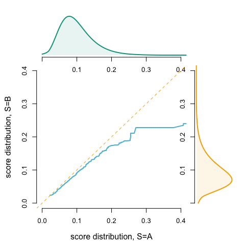

``` r
## ----------
```

## Random Forrest

``` r
set.seed(1234)
xA=xA_rf
xB=xB_rf
d_A_s = d_A_s_rf
d_B_s = d_B_s_rf
 if(length(xB)<length(xA)) xA = xA[sample(1:length(xA),size = length(xB))]
 if(length(xB)>length(xA)) xB = xB[sample(1:length(xB),size = length(xA))]

 {
    mat = matrix(c(1,2,0,3), 2)
    par(mfrow = c(2,2))
    layout(mat, c(3.5,1), c(1,3))
    par(mar = c(0.5, 4.5, 0.5, 0.5))
  }
  
plot(d_A_s$x,d_A_s$y,type="l",col=vectcolor["A"],lwd=2,axes=FALSE,xlab="",ylab="",
xlim=c(0,.4),ylim=c(0,12))
polygon(c(0,d_A_s$x,1),c(0,d_A_s$y,0),col=scales::alpha(vectcolor["A"],.1),border=NA)
axis(1,at=(0:4)/10,label=c(NA,.1,.2,.3,.4))
  par(mar=c(4.5, 4.5, 0.5, 0.5))
  # Optimal transport (quantile based)
  plot(sort(xA), sort(xB),
       col = vectcolor[1], lwd = 2,
       type = "l",
       xlab = "",
       ylab = "",
       xlim=c(0,.4),
       ylim=c(0,.4),
       axes=FALSE)
  abline(a = 0, b = 1, col = vectcolor[4], lty = 2)
  axis(1)
  axis(2)
  mtext("score distribution, S=A", side=1,line=3, col = "black")
  mtext("score distribution, S=B", side=2,line=3, col = "black")

    par(mar = c(4.5, 0.5, 0.5, 0.5))
    plot(d_B_s$y,d_B_s$x,type="l",col=vectcolor["B"],lwd=2,ylim=c(0,.4),xlim=c(0,12),xlab="",ylab="",axes=FALSE)
    polygon(c(0,d_B_s$y,0),c(0,d_B_s$x,1),col=scales::alpha(vectcolor["B"],.1),border=NA)
    axis(2,at=(0:4)/10,label=c(NA,.1,.2,.3,NA))      
```

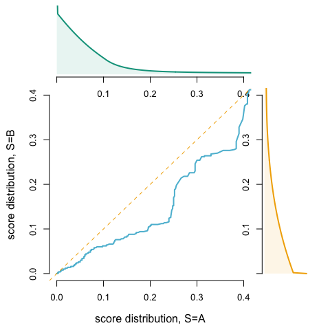

# Wassertein barycenters

## Plain logistic (GLM)

``` r
vx = seq(0,1,length=501)
x1 = xA_glm
x2 = xB_glm
wA = mean(df_valid$sensitive == "A")
wB = mean(df_valid$sensitive == "B")
T = function(x) wA*x + wB*quantile(x2,ecdf(x1)(x))

T_borneinf = T(.000001)
T_bornesup = T(1-.000001)
Tinv = function(u) ifelse(u<=T_borneinf,0,ifelse(u>=T_bornesup,1,uniroot(function(x) T(x)-u,interval=c(0,1))$root))
dTinv = function(x,h=.005) (Tinv(x+h)-Tinv(x-h))/(2*h)
VTx = Vectorize(Tinv)(vx)
dVTx = Vectorize(dTinv)(vx)
# d1 = density(x1,from = min(0), to = max(1), n = 800+1)
# d2 = density(x2,from = min(0), to = max(1), n = 800+1)
kd1 = kdensity(x1,kernel="beta")
kd2 = kdensity(x2,kernel="beta")
d1 = data.frame(x=vx,
                y=kd1(vx))
d2 = data.frame(x=vx,
                y=kd2(vx))
d1y = d1$y
names(d1y)=round(d1$x,3)
VTy = d1y[as.character(round(VTx,3))]

VTx = Vectorize(Tinv)(vx)
dVTx = Vectorize(dTinv)(vx)
dk3 = kdensity(x1,kernel="beta")
d3 = data.frame(x=VTx,
                y=dk3(VTx))
```

``` r
 {
    mat = matrix(c(1,2,0,3), 2)
    par(mfrow = c(2,2))
    layout(mat, c(3.5,1), c(1,3))
    par(mar = c(0.5, 4.5, 0.5, 0.5))
  }

vx=d1$x

plot(vx,d1$y,type="l",col=vectcolor["A"],lwd=2,axes=FALSE,xlab="",ylab="",
     xlim=c(0,.4),ylim=c(0,12))
polygon(c(0,vx,1),c(0,d1$y,0),col=scales::alpha(vectcolor["A"],.1),border=NA)
axis(1,at=(0:4)/10,label=c(NA,.1,.2,.3,NA))
  par(mar=c(4.5, 4.5, 0.5, 0.5))
  plot(sort(vx), sort(Vectorize(T)(vx)),
       col = vectcolor["A"], lwd = 2,
       type = "l",
       xlab = "",
       ylab = "",
       xlim=c(0,.4),
       ylim=c(0,.4),
       axes=FALSE)
  abline(a = 0, b = 1, col = vectcolor["with"], lty = 2)
  axis(1)
  axis(2)
  mtext("score distribution, S=A", side=1,line=3, col = "black")
  mtext("score distribution, S transported", side=2,line=3, col = "black")
    par(mar = c(4.5, 0.5, 0.5, 0.5))
    plot(d3$y*dVTx,d3$x,type="l",col=vectcolor["with"],lwd=2,ylim=c(0,.4),
         xlab="",ylab="",axes=FALSE,xlim=c(0,12))
    polygon(c(0,d3$y*dVTx,0),c(0,d3$x,1),col=scales::alpha(vectcolor["with"],.1),border=NA)
    axis(2,at=(0:4)/10,label=c(NA,.1,.2,.3,NA))
```

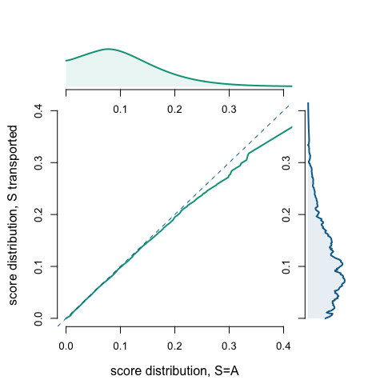

``` r
 {
    mat = matrix(c(1,2,0,3), 2)
    par(mfrow = c(2,2))
    layout(mat, c(3.5,1), c(1,3))
    par(mar = c(0.5, 4.5, 0.5, 0.5))
  }

plot(vx,d2$y,type="l",col=vectcolor["B"],lwd=2,axes=FALSE,xlab="",ylab="",
        xlim=c(0,.4),ylim=c(0,12))
polygon(c(0,vx,1),c(0,d2$y,0),col=scales::alpha(vectcolor["B"],.1),border=NA)
axis(1,at=(0:4)/10,label=c(NA,.1,.2,.3,NA))
  par(mar=c(4.5, 4.5, 0.5, 0.5))
  plot( sort(Vectorize(T)(vx)),sort(vx),
       col = vectcolor["B"], lwd = 2,
       type = "l",
       xlab = "",
       ylab = "",
       xlim=c(0,.4),
       ylim=c(0,.4),
       axes=FALSE)
  abline(a = 0, b = 1, col = vectcolor["with"], lty = 2)
  axis(1)
  axis(2)
  mtext("score distribution, S=B", side=1,line=3, col = "black")
  mtext("score distribution, S transported", side=2,line=3, col = "black")
    par(mar = c(4.5, 0.5, 0.5, 0.5))
    plot(d3$y*dVTx,d3$x,type="l",col=vectcolor["with"],lwd=2,ylim=c(0,.4),xlab="",ylab="",axes=FALSE,xlim=c(0,12))
    polygon(c(0,d3$y*dVTx,0),c(0,d3$x,1),col=scales::alpha(vectcolor["with"],.1),border=NA)
    axis(2,at=(0:4)/10,label=c(NA,.1,.2,.3,NA))
```

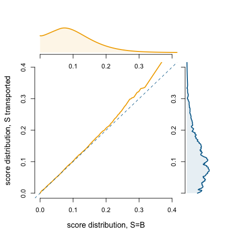

## Gradient boosting (GBM)

``` r
vx = seq(0,1,length=801)
x1 = xA_gbm
x2 = xB_gbm
wA = mean(df_valid$sensitive == "A")
wB = mean(df_valid$sensitive == "B")
T = function(x) wA*x + wB*quantile(x2,ecdf(x1)(x))

T_borneinf = T(.000001)
T_bornesup = T(1-.000001)
Tinv = function(u) ifelse(u<=T_borneinf,0,ifelse(u>=T_bornesup,1,uniroot(function(x) T(x)-u,interval=c(0,1))$root))
dTinv = function(x,h=.005) (Tinv(x+h)-Tinv(x-h))/(2*h)
VTx = Vectorize(Tinv)(vx)
dVTx = Vectorize(dTinv)(vx)
kd1 = kdensity(x1,kernel="beta")
kd2 = kdensity(x2,kernel="beta")
d1 = data.frame(x=vx,
                y=kd1(vx))
d2 = data.frame(x=vx,
                y=kd2(vx))
d1y = d1$y
names(d1y)=round(d1$x,3)
VTy = d1y[as.character(round(VTx,3))]

VTx = Vectorize(Tinv)(vx)
dVTx = Vectorize(dTinv)(vx)
dk3 = kdensity(x1,kernel="beta")
d3 = data.frame(x=VTx,
                y=dk3(VTx))
```

``` r
 {
    mat = matrix(c(1,2,0,3), 2)
    par(mfrow = c(2,2))
    layout(mat, c(3.5,1), c(1,3))
    par(mar = c(0.5, 4.5, 0.5, 0.5))
  }
vx=d1$x

plot(vx,d1$y,type="l",col=vectcolor["A"],lwd=2,axes=FALSE,xlab="",ylab="",
     xlim=c(0,.4),ylim=c(0,12))
polygon(c(0,vx,1),c(0,d1$y,0),col=scales::alpha(vectcolor["A"],.1),border=NA)
axis(1,at=(0:4)/10,label=c(NA,.1,.2,.3,NA))
  par(mar=c(4.5, 4.5, 0.5, 0.5))
  plot(sort(vx), sort(Vectorize(T)(vx)),
       col = vectcolor["A"], lwd = 2,
       type = "l",
       xlab = "",
       ylab = "",
       xlim=c(0,.4),
       ylim=c(0,.4),
       axes=FALSE)
  abline(a = 0, b = 1, col = vectcolor["with"], lty = 2)
  axis(1)
  axis(2)
  mtext("score distribution, S=A", side=1,line=3, col = "black")
  mtext("score distribution, S transported", side=2,line=3, col = "black")
    par(mar = c(4.5, 0.5, 0.5, 0.5))
    plot(d3$y*dVTx,d3$x,type="l",col=vectcolor["with"],lwd=2,ylim=c(0,.4),
         xlab="",ylab="",axes=FALSE,xlim=c(0,12))
    polygon(c(0,d3$y*dVTx,0),c(0,d3$x,1),col=scales::alpha(vectcolor["with"],.1),border=NA)
    axis(2,at=(0:4)/10,label=c(NA,.1,.2,.3,NA))
```

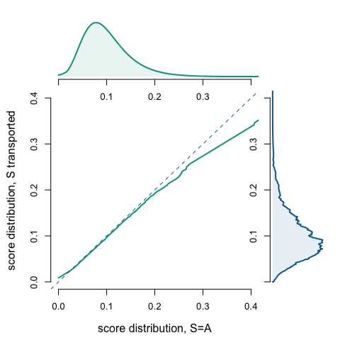

``` r
 {
    mat = matrix(c(1,2,0,3), 2)
    par(mfrow = c(2,2))
    layout(mat, c(3.5,1), c(1,3))
    par(mar = c(0.5, 4.5, 0.5, 0.5))
  }

plot(vx,d2$y,type="l",col=vectcolor["B"],lwd=2,axes=FALSE,xlab="",ylab="",
        xlim=c(0,.4),ylim=c(0,12))
polygon(c(0,vx,1),c(0,d2$y,0),col=scales::alpha(vectcolor["B"],.1),border=NA)
axis(1,at=(0:4)/10,label=c(NA,.1,.2,.3,NA))
  par(mar=c(4.5, 4.5, 0.5, 0.5))
  plot( sort(Vectorize(T)(vx)),sort(vx),
       col = vectcolor["B"], lwd = 2,
       type = "l",
       xlab = "",
       ylab = "",
       xlim=c(0,.4),
       ylim=c(0,.4),
       axes=FALSE)
  abline(a = 0, b = 1, col = vectcolor["with"], lty = 2)
  axis(1)
  axis(2)
  mtext("score distribution, S=B", side=1,line=3, col = "black")
  mtext("score distribution, S transported", side=2,line=3, col = "black")

    par(mar = c(4.5, 0.5, 0.5, 0.5))
    plot(d3$y*dVTx,d3$x,type="l",col=vectcolor["with"],lwd=2,ylim=c(0,.4),xlab="",ylab="",axes=FALSE,xlim=c(0,12))
    polygon(c(0,d3$y*dVTx,0),c(0,d3$x,1),col=scales::alpha(vectcolor["with"],.1),border=NA)
    axis(2,at=(0:4)/10,label=c(NA,.1,.2,.3,NA))
```

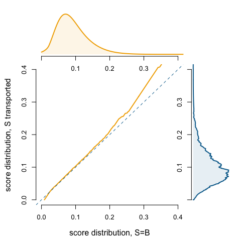

## Random Forrest

``` r
vx = seq(0,1,length=801)
x1 = xA_rf
x2 = xB_rf
wA = mean(df_valid$sensitive == "A")
wB = mean(df_valid$sensitive == "B")
T = function(x) wA*x + wB*quantile(x2,ecdf(x1)(x))

T_borneinf = T(.000001)
T_bornesup = T(1-.000001)
Tinv = function(u) ifelse(u<=T_borneinf,0,ifelse(u>=T_bornesup,1,uniroot(function(x) T(x)-u,interval=c(0,1))$root))
dTinv = function(x,h=.005) (Tinv(x+h)-Tinv(x-h))/(2*h)
VTx = Vectorize(Tinv)(vx)
dVTx = Vectorize(dTinv)(vx)
kd1 = kdensity(x1,kernel="beta")
kd2 = kdensity(x2,kernel="beta")
d1 = data.frame(x=vx,
                y=kd1(vx))
d2 = data.frame(x=vx,
                y=kd2(vx))
d1y = d1$y
names(d1y)=round(d1$x,3)
VTy = d1y[as.character(round(VTx,3))]

VTx = Vectorize(Tinv)(vx)
dVTx = Vectorize(dTinv)(vx)
dk3 = kdensity(x1,kernel="beta")
d3 = data.frame(x=VTx,
                y=dk3(VTx))
```

``` r
 {
    mat = matrix(c(1,2,0,3), 2)
    par(mfrow = c(2,2))
    layout(mat, c(3.5,1), c(1,3))
    par(mar = c(0.5, 4.5, 0.5, 0.5))
  }
vx=d1$x

plot(vx,d1$y,type="l",col=vectcolor["A"],lwd=2,axes=FALSE,xlab="",ylab="",
     xlim=c(0,.4),ylim=c(0,12))
polygon(c(0,vx,1),c(0,d1$y,0),col=scales::alpha(vectcolor["A"],.1),border=NA)
axis(1,at=(0:4)/10,label=c(NA,.1,.2,.3,NA))
  par(mar=c(4.5, 4.5, 0.5, 0.5))
  plot(sort(vx), sort(Vectorize(T)(vx)),
       col = vectcolor["A"], lwd = 2,
       type = "l",
       xlab = "",
       ylab = "",
       xlim=c(0,.4),
       ylim=c(0,.4),
       axes=FALSE)
  abline(a = 0, b = 1, col = vectcolor["with"], lty = 2)
  axis(1)
  axis(2)
  mtext("score distribution, S=A", side=1,line=3, col = "black")
  mtext("score distribution, S transported", side=2,line=3, col = "black")
    par(mar = c(4.5, 0.5, 0.5, 0.5))
    plot(d3$y*dVTx,d3$x,type="l",col=vectcolor["with"],lwd=2,ylim=c(0,.4),
         xlab="",ylab="",axes=FALSE,xlim=c(0,12))
    polygon(c(0,d3$y*dVTx,0),c(0,d3$x,1),col=scales::alpha(vectcolor["with"],.1),border=NA)
    axis(2,at=(0:4)/10,label=c(NA,.1,.2,.3,NA))
```

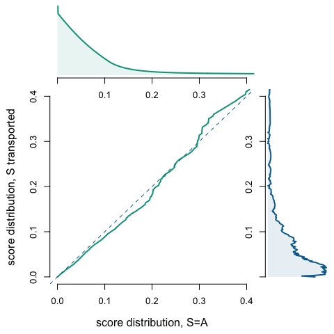

``` r
 {
    mat = matrix(c(1,2,0,3), 2)
    par(mfrow = c(2,2))
    layout(mat, c(3.5,1), c(1,3))
    par(mar = c(0.5, 4.5, 0.5, 0.5))
  }

plot(vx,d2$y,type="l",col=vectcolor["B"],lwd=2,axes=FALSE,xlab="",ylab="",
        xlim=c(0,.4),ylim=c(0,12))
polygon(c(0,vx,1),c(0,d2$y,0),col=scales::alpha(vectcolor["B"],.1),border=NA)
axis(1,at=(0:4)/10,label=c(NA,.1,.2,.3,NA))
  par(mar=c(4.5, 4.5, 0.5, 0.5))
  # Optimal transport (quantile based)
  plot( sort(Vectorize(T)(vx)),sort(vx),
       col = vectcolor["B"], lwd = 2,
       type = "l",
       xlab = "",
       ylab = "",
       xlim=c(0,.4),
       ylim=c(0,.4),
       axes=FALSE)
  abline(a = 0, b = 1, col = vectcolor["with"], lty = 2)
  axis(1)
  axis(2)
  mtext("score distribution, S=B", side=1,line=3, col = "black")
  mtext("score distribution, S transported", side=2,line=3, col = "black")
    par(mar = c(4.5, 0.5, 0.5, 0.5))
    plot(d3$y*dVTx,d3$x,type="l",col=vectcolor["with"],lwd=2,ylim=c(0,.4),xlab="",ylab="",axes=FALSE,xlim=c(0,12))
    polygon(c(0,d3$y*dVTx,0),c(0,d3$x,1),col=scales::alpha(vectcolor["with"],.1),border=NA)
    axis(2,at=(0:4)/10,label=c(NA,.1,.2,.3,NA))
```

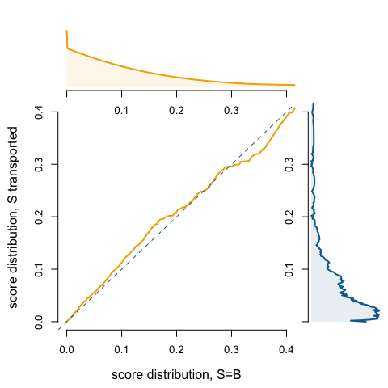

# Wassertein Barycenter - Scatterplots

``` r
par(mfrow=c(1,3))
x1 = xA_glm
x2 = xB_glm
wA = mean(df_valid$sensitive == "A")
wB = mean(df_valid$sensitive == "B")
TAB = function(x) wA*x + wB*quantile(x2,ecdf(x1)(x))
TBA = function(x) wA*quantile(x1,ecdf(x2)(x)) + wB*x
```

From group A to the barycenter, for the plain logistic model

``` r
round(TAB(c(.05,.1,.2))*100,2)
```

    22.11943% 64.84441% 95.96299% 
         4.94      9.84     19.50 

and from group B to the barycenter

``` r
round(TBA(c(.05,.1,.2))*100,2)
```

    23.79897%  68.4405% 96.82188% 
         5.16     10.38     20.77 

``` r
TxA = TAB(x1) 
TxB = TBA(x2)  
plot(x1,TxA,
     xlim=c(0,.4),ylim=c(0,.4),
     col="white",pch=19,cex=.4,
     xlab="Initial score (GLM)",ylab="Fair score (postprocessing)")
segments(0,0,1,1,col="grey")
segments(0,0,1,rA,col=vectcolor["A"],lwd=.2)
segments(0,0,1,rB,col=vectcolor["B"],lwd=.2)
     #xlim=c(.15,.18),ylim=c(.15,.18))
segments(x1,TxA,x1,x1,col=scales::alpha(vectcolor["A"],.2))
segments(x2,TxB,x2,x2,col=scales::alpha(vectcolor["B"],.2))
points(x2,TxB,xlim=c(0,.4),col=scales::alpha(vectcolor["B"],.3),pch=19,cex=.7)
points(x1,TxA,xlim=c(0,.4),col=scales::alpha(vectcolor["A"],.3),pch=19,cex=.7)
```

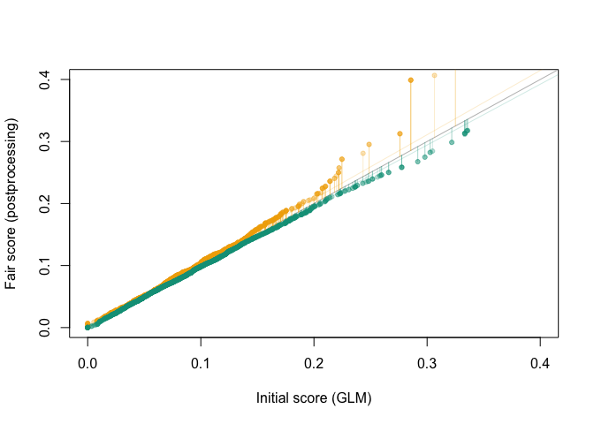

``` r
x1 = xA_gbm
x2 = xB_gbm
wA = mean(df_valid$sensitive == "A")
wB = mean(df_valid$sensitive == "B")
TAB = function(x) wA*x + wB*quantile(x2,ecdf(x1)(x))
TBA = function(x) wA*quantile(x1,ecdf(x2)(x)) + wB*x
```

From group A to the barycenter, for the boosting model

``` r
round(TAB(c(.05,.1,.2))*100,2)
```

     8.83095% 66.31623% 97.85534% 
         4.79      9.69     19.23 

and from group B to the barycenter

``` r
round(TBA(c(.05,.1,.2))*100,2)
```

    14.19069% 73.54028% 99.18699% 
         5.35     10.57     23.42 

``` r
TxA = TAB(x1) 
TxB = TBA(x2)  
plot(x1,TxA,
     xlim=c(0,.4),ylim=c(0,.4),
     col="white",pch=19,cex=.4,
     xlab="Initial score (GBM)",ylab="Fair score (postprocessing)")
segments(0,0,1,1,col="grey")
segments(0,0,1,rA,col=vectcolor["A"],lwd=.2)
segments(0,0,1,rB,col=vectcolor["B"],lwd=.2)
segments(x1,TxA,x1,x1,col=scales::alpha(vectcolor["A"],.2))
segments(x2,TxB,x2,x2,col=scales::alpha(vectcolor["B"],.2))
points(x2,TxB,xlim=c(0,.4),col=scales::alpha(vectcolor["B"],.3),pch=19,cex=.7)
points(x1,TxA,xlim=c(0,.4),col=scales::alpha(vectcolor["A"],.3),pch=19,cex=.7)
```

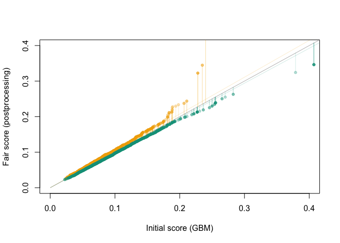

``` r
x1 = xA_rf
x2 = xB_rf
wA = mean(df_valid$sensitive == "A")
wB = mean(df_valid$sensitive == "B")
TAB = function(x) wA*x + wB*quantile(x2,ecdf(x1)(x))
TBA = function(x) wA*quantile(x1,ecdf(x2)(x)) + wB*x

TxA = TAB(x1) 
TxB = TBA(x2)  
plot(x1,TxA,
     xlim=c(0,.4),ylim=c(0,.4),
     col="white",pch=19,cex=.4,
     xlab="Initial score (RF)",ylab="Fair score (postprocessing)")
segments(0,0,1,1,col="grey")
segments(0,0,1,rA,col=vectcolor["A"],lwd=.2)
segments(0,0,1,rB,col=vectcolor["B"],lwd=.2)
segments(x1,TxA,x1,x1,col=scales::alpha(vectcolor["A"],.2))
segments(x2,TxB,x2,x2,col=scales::alpha(vectcolor["B"],.2))
points(x2,TxB,xlim=c(0,.4),col=scales::alpha(vectcolor["B"],.3),pch=19,cex=.7)
points(x1,TxA,xlim=c(0,.4),col=scales::alpha(vectcolor["A"],.3),pch=19,cex=.7)
```

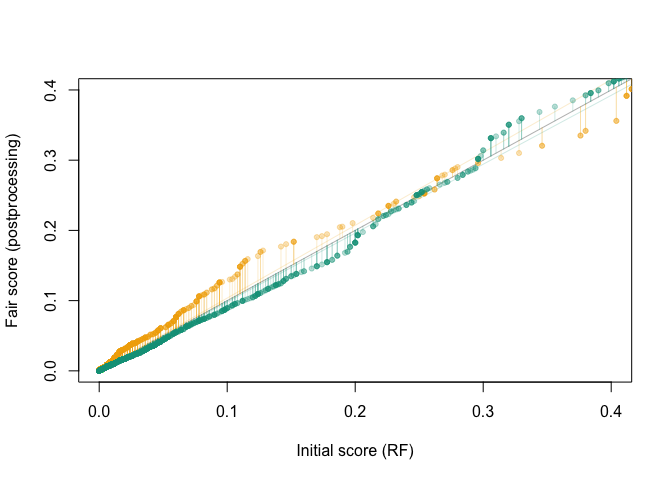

From group A to the barycenter, for the random forrest

``` r
round(TAB(c(.05,.1,.2))*100,2)
```

    76.07233% 81.95963%  86.2069% 
         4.42      8.92     18.26 

and from group B to the barycenter

``` r
round(TBA(c(.05,.1,.2))*100,2)
```

    78.64006% 84.40503% 86.69623% 
         6.15     12.80     21.12 
